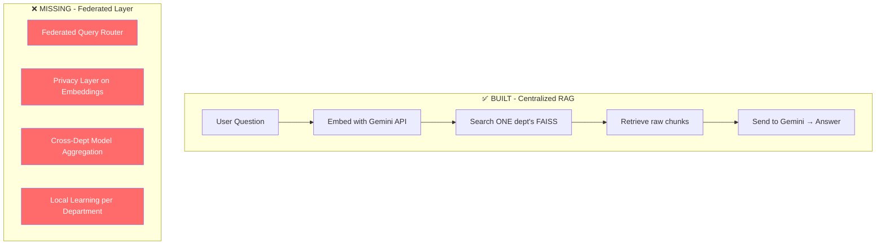
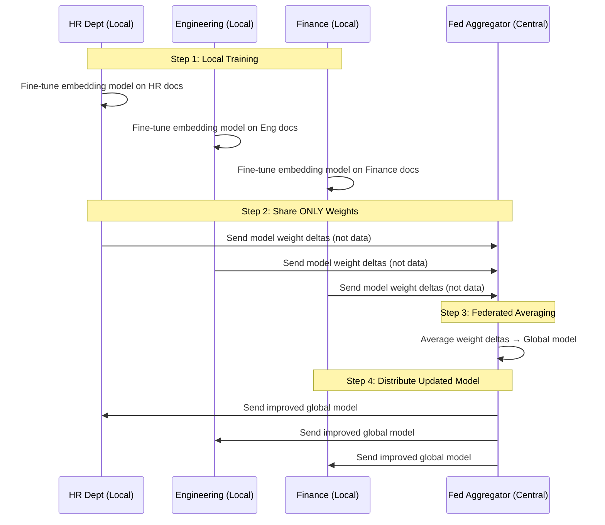

# Federated Learning Implementation Plan

## What You Have vs. What's Missing



---

## Phase 1: Federated Query Router (Priority: HIGH)

**What it does:** A lightweight model learns which departments likely have relevant answers — without seeing their actual documents. Users can get answers from multiple departments in one query, but each department's data stays isolated.

**How it works:**
1. Each department publishes a **topic summary** (not raw data) — e.g., "HR: policies, benefits, onboarding"
2. A global router uses these summaries to decide which departments to query
3. Results from multiple departments are merged and ranked

### New Files

#### [NEW] `backend/app/services/federated_router.py`
```python
class FederatedRouter:
    """Routes queries to relevant departments without seeing their data."""
    
    async def build_department_profile(dept_id: str) -> dict:
        """Creates a privacy-safe topic summary from a dept's FAISS metadata.
        Only stores: topic keywords, document count, avg embedding centroid.
        Never stores: raw text, filenames, actual content."""
    
    async def route_query(query: str, user_dept: str) -> list[str]:
        """Returns ranked list of department IDs likely to have answers.
        Uses cosine similarity between query embedding and dept centroids."""
    
    async def federated_search(query: str, dept_ids: list[str]) -> list[dict]:
        """Searches multiple departments, merges results, removes duplicates."""
```

#### Changes to existing files

##### [MODIFY] `backend/app/services/rag_engine.py`
- Add `federated_mode` parameter to `query_stream()`
- When federated mode is ON: use `FederatedRouter.route_query()` to find relevant depts, then `federated_search()` across them
- Merge and deduplicate results before generating response
- Tag each source with its department origin

##### [MODIFY] `backend/app/services/vector_store.py`
- Add `get_centroid(dept_id)` — returns the average embedding vector (not raw data)
- Add `get_topic_keywords(dept_id)` — extracts top keywords from metadata

##### [MODIFY] `backend/app/routers/chat.py`
- Add `federated: bool = False` to `ChatRequest` schema
- Pass through to `rag_engine.query_stream()`

##### [MODIFY] Frontend `app/hooks/useChat.ts`
- Add `federated` boolean to the chat request payload

##### [MODIFY] Frontend `app/components/chat/ChatInput.tsx`
- Add a toggle: "🔗 Search across departments" switch

##### [MODIFY] Frontend `app/components/chat/ChatMessage.tsx`
- Show department badge on sources: `[HR] employee_handbook.pdf`

---

## Phase 2: Privacy Layer (Priority: HIGH)

**What it does:** Adds differential privacy noise to embeddings before storage, so even if someone accesses the FAISS index, they can't reconstruct the original text.

### New Files

#### [NEW] `backend/app/services/privacy.py`
```python
class PrivacyEngine:
    """Applies differential privacy to vector embeddings."""
    
    def add_noise(embedding: list[float], epsilon: float = 1.0) -> list[float]:
        """Adds calibrated Gaussian noise to embedding vectors.
        epsilon controls privacy budget (lower = more private, noisier)."""
    
    def clip_embedding(embedding: list[float], max_norm: float) -> list[float]:
        """Clips embedding to max L2 norm before adding noise."""
    
    def get_privacy_budget(dept_id: str) -> dict:
        """Tracks cumulative privacy budget spent per department."""
```

#### Changes to existing files

##### [MODIFY] `backend/app/services/embeddings.py`
- After `embed_documents()`, pass each embedding through `PrivacyEngine.add_noise()`
- Store original (for the owning department) + noised version (for federated queries)

##### [NEW DB Model] `DepartmentPrivacyConfig` table
```
department_id, epsilon, max_norm, total_queries, privacy_budget_used
```

---

## Phase 3: Federated Model Aggregation (Priority: MEDIUM)

**What it does:** Each department fine-tunes a small local embedding model. Periodically, the model weights (not data) are aggregated using **Federated Averaging (FedAvg)** to create a better global model.

> [!IMPORTANT]
> This is the true "Federated Learning" component. It's more complex than Phases 1-2 but is what makes the system genuinely federated.

### How It Works



### New Files

#### [NEW] `backend/app/services/federated_learning.py`
```python
class LocalTrainer:
    """Fine-tunes a small embedding adapter per department."""
    
    async def train_local(dept_id: str) -> dict:
        """Trains on dept's documents, returns weight deltas only.
        Uses a lightweight adapter (LoRA-style) on top of base embedding model.
        Raw data never leaves this function."""

class FederatedAggregator:
    """Aggregates model updates using FedAvg."""
    
    async def collect_updates(dept_updates: dict[str, dict]) -> dict:
        """Collects weight deltas from all departments."""
    
    async def fedavg(updates: list[dict], weights: list[float]) -> dict:
        """Weighted average of model deltas. 
        Weight proportional to department's doc count."""
    
    async def distribute_global_model(global_weights: dict):
        """Sends updated model to all departments."""
```

#### [NEW] `backend/app/services/embedding_adapter.py`
```python
class EmbeddingAdapter:
    """Lightweight adapter layer on top of Gemini embeddings.
    This is what gets fine-tuned locally and aggregated federally."""
    
    # Small neural network (2-layer MLP) that transforms
    # Gemini's base embeddings into department-optimized ones.
    # ~50K parameters, trains in seconds on CPU.
```

#### [NEW DB Models]

```
FederationRound: id, round_number, started_at, completed_at, 
                 participating_depts, global_model_path

DepartmentModelState: dept_id, local_model_path, last_trained_at,
                      documents_trained_on, federation_round_id
```

#### [NEW] `backend/app/routers/federation.py`
```
POST /federation/train-local      — Trigger local training for a dept
POST /federation/aggregate         — Run FedAvg across all dept updates  
GET  /federation/status            — Current federation round status
GET  /federation/rounds            — History of federation rounds
```

---

## Phase 4: Frontend Updates (Priority: LOW)

### Chat Interface Changes

##### [MODIFY] `app/components/chat/ChatInput.tsx`
- Add federated search toggle with tooltip
  
##### [MODIFY] `app/components/chat/ChatMessage.tsx`
- Department badges on federated sources
- Privacy indicator (shield icon + epsilon value)

### Admin Dashboard Additions

##### [NEW] `app/pages/AdminFederation.tsx`
- Federation status dashboard
- Per-department training status
- Privacy budget usage per department
- Trigger manual federation rounds
- History of aggregation rounds with metrics

---

## Recommended Implementation Order

| Order | Phase | Effort | Impact |
|-------|-------|--------|--------|
| **1** | Phase 1: Federated Query Router | ~2-3 days | Users can search across departments immediately |
| **2** | Phase 2: Privacy Layer | ~1-2 days | Embeddings become privacy-protected |
| **3** | Phase 4: Frontend Updates | ~1-2 days | UI reflects federated capabilities |
| **4** | Phase 3: Federated Aggregation | ~4-5 days | True federated learning with FedAvg |

> [!TIP]
> Phase 1 alone transforms your product from "department-isolated RAG" to "federated enterprise chatbot." It's the highest-impact change. Phases 2-3 add privacy guarantees and actual federated learning.

## What NOT to Change

- ✅ Keep the existing per-department FAISS architecture — it's the foundation
- ✅ Keep Gemini API for generation — no need for local LLMs
- ✅ Keep the existing chat UI/UX — just add federated toggle + badges
- ✅ Keep the existing auth/RBAC system
